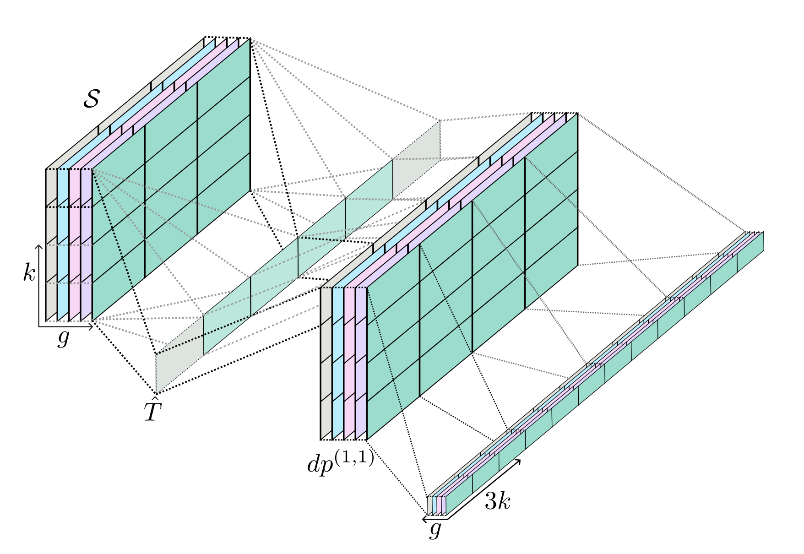
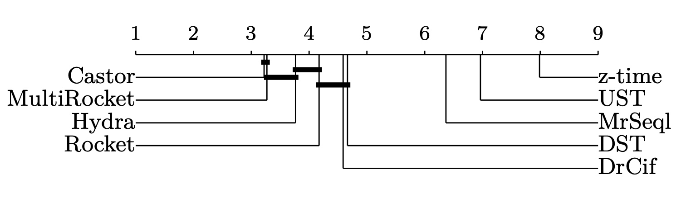
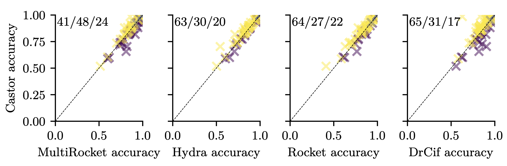
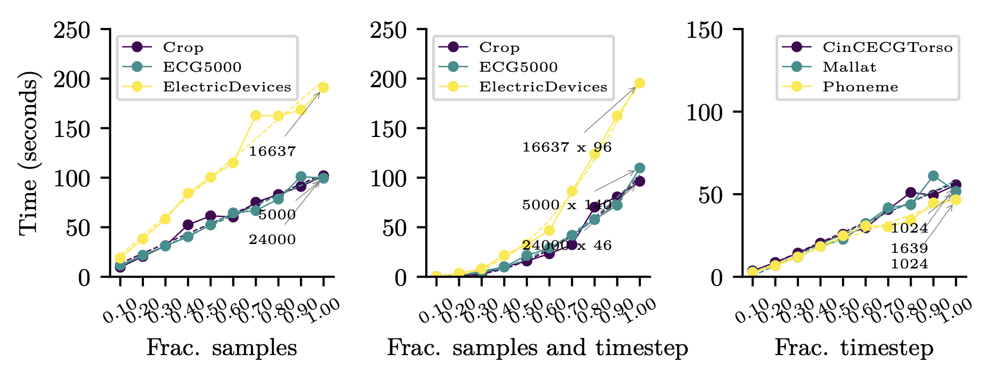

# Castor: Competing Dilated Shapelet Transform



<p align="center">
        📖 <a href="">Paper</a>&nbsp&nbsp ｜ &nbsp🤗 <a href="./example.ipynb">Notebook</a>&nbsp&nbsp | &nbsp🌟<a href="#Results">Results</a>&nbsp&nbsp | &nbsp🖊 <a href="https://github.com/wildboar-foundation/wildboar/blob/c79b77a733369cfdee765f1cb490b6ceafedb4f2/src/wildboar/transform/_cshapelet.pyx#L949">Code</a>
</p>
<br>

Castor is a simple and efficient time series transformation to construct accurate classifiers from dilated shapelets. The transformation organizes shapelets into groups and allow the shapelets to _compete_ over the time steps to construct a diverse feature representation. By organizing shapelets into groups, we enable the transformation to transition between levels of competition, resulting in methods that more closely resembles distance-based transformations or dictionary-based transformations.

You can try Castor today!

```shell
$ pip install wildboar==1.2.beta6
```

In a Python REPL:

```python
>>> from wildboar.datasets import load_dataset
>>> from wildboar.transform import CastorTransform
>>> X, y = load_dataset("GunPoint")
>>> t = CastorTransform()
>>> t.fit_transform(X)
```

## Runnable Psudocode!

Castor is very simple to implement, given a function that can compute the _dilated distance profile_ between a subsequence and a time series.

```python
from numpy import empty
from numpy.random import randint

from wildboar.distance import distance_profile

def fit_castor(X, g, k, l, p_low=0.05, p_high=0.2):
    m, n = X.shape
    E = int(log2((n - 1) / float(l - 1))) + 1
    print(E)
    G = empty((g, k, E, l))
    T = empty((g, k, E))
    for i in range(g):
        for j in range(k):
            for e in range(E):
                d = 2**e
                l_hat = (l - 1) * d + 1
                o = randint(0, n - l_hat)
                s = randint(0, m)
                G[i, j, e, :] = X[s, o : o + l_hat : d]
                dp = sort(
                    distance_profile(
                        G[i, j, e, :].reshape(1, -1), X[s], dilation=d, padding=l_hat // 2
                    )
                )
                T[i, j, e] = dp[randint(int(p_low * n), int(p_high * n))]
    return G, T
```

Similarly, the transformation function:

```python
from numpy import empty, argmax, argmin
from numpy.random import randint

from wildboar.distance import distance_profile
def castor_transform(G, T, X):
    g, k, E, l = G.shape
    m, n = X.shape
    out = zeros((m, g, E, k * 3))
    for s in range(m):
        for i in range(g):
            for e in range(E):
                dp = empty((k, n))
                d = 2**e
                l_hat = (l - 1) * d + 1
                for j in range(k):
                    dp[j, :] = distance_profile(
                        G[i, j, e].reshape(1, -1), X[s], dilation=d, padding=l_hat // 2
                    )

                add.at(out[s, i, e, 0:k], argmax(dp, axis=0), 1)
                add.at(out[s, i, e, k:2*k], argmin(dp, axis=0), 1)
                T[i, :, e].reshape(1, -1)
                out[s, i, e, 2 * k:] += sum(dp < T[i, :, e].reshape(-1, 1), axis=1)

    return out.reshape(m, (g * k * 3 * E))
```

Note that, both `fit_castor` and `castor_transform` are simplified and does not allow for tuning many of the hyperparameters that allows Castor to create exceptionally accurate transformation. In particular, the functions does not allow for normalized distance profiles, which turns out to be very important, and nor does it support soft minus or maximum distances. For all practical purposes, one is encouraged to use `wildboar.transform.CastorTransform` and `wildboar.linear_models.CastorClassifier` if one intends create a classifier. The former does not support first-order differences unless explicitly asked to.

In the following example, we make use of standard `scikit-learn` pipelines to enable first-order differences:

```python
>>> from sklearn.pipeline import make_pipeline, make_union
>>> from wildboar.transform import DiffTransform
>>> t = make_union(make_pipeline(DiffTransform(), CastorTransform()), CastorTransform())
```

Using the classifier is as simple as:

```python
>>> from wildboar.datasets import load_dataset
>>> from wildboar.linear_model import CastorClassifier
>>> X_train, X_test, y_train, y_test = load_dataset("GunPoint", merge_train_test=False)
>>> t = CastorClassifier(n_jobs=-1)
>>> t.fit(X_train, y_train).score(X_test, y_test)
```

## Results







The full results are available in the file `results.csv`. The file can be loaded in Pandas using:

```python
import pandas as pd
pd.read_csv("results.csv", header=[0,1], index_col=0)
```
